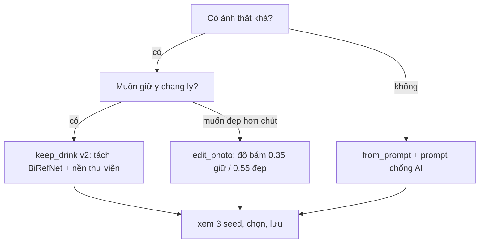

# Ảnh menu nhất quán, giống thật, không vỡ, không "mùi AI" — kế hoạch nghiên cứu + triển khai

> **Ngày lập:** 2026-09-29 · **Trạng thái:** nghiên cứu SOTA xong, chờ spike P0
> **Phạm vi:** `POST /api/v1/menu/{id}/anh/generate` (3 mode) + `bg_redesign.py` + `menu_style.py` + `menu_prompt.py` + UI `/menu`
> **Không đụng:** auth/RBAC, worker lịch, KV lifecycle (giữ nguyên fail-closed + `_require_chu_quan`)
> **Ràng buộc cứng:** ngân sách 0 đồng · giấy phép dùng được thương mại (MIT/Apache-2.0/BSD) · demo rút mạng vẫn chạy (§14.9) · Python 3.12 · `ruff` + `mypy --strict` + `tsc --noEmit` xanh

---

## 0. Tóm tắt 1 trang

Ảnh quảng cáo hiện có 3 chế độ (`from_prompt` / `edit_photo` / `keep_drink`) nhưng vẫn dính 4 bệnh: (1) nhìn "quá AI" (da ly nhựa, bokeh giả, HDR gắt), (2) vỡ/méo khi đổi khung, (3) không còn giống ly thật, (4) 10 món ra 10 tông khác nhau.

Hướng chốt sau khi rà SOTA: **lấy `keep_drink` làm đường chính** (giữ 100% pixel ly), thay ruột tách nền flood-fill bằng **BiRefNet-general-lite ONNX qua `rembg` (CPU) + decontaminate**, nền lấy từ **thư viện nền thật của quán** trước, chỉ gọi Cloudflare/Pollinations khi cần nền mới; thêm bước **hòa sáng cục bộ** (học từ IC-Light nhưng làm bằng Pillow/numpy, không kéo torch vào API); chống vỡ bằng **sinh đúng kích thước khung + upscale tối đa 2x** (Real-ESRGAN chỉ để tham khảo, không đưa vào prod vì nặng + SUPIR cấm thương mại); khóa nhất quán bằng **brand kit + seed + nền dùng chung** đã có. Mọi bước hỏng đều fail-closed (trả lỗi tiếng Việt, không ghép ảnh rác).

---

## 1. Ngữ cảnh chức năng hiện tại (đọc từ code thật)

### 1.1 Luồng hiện tại

```
UI /menu (page.tsx: nút "Tạo ảnh quảng cáo (AI)")
  → POST /menu/{id}/anh/prompt (dựng prompt tất định, không gọi mạng)
  → người dùng xem/sửa prompt EN + chọn mode + style + khung + mô tả thêm
  → POST /menu/{id}/anh/generate {prompt_en, mode, style_slug, aspect_ratio, seed?, original_base64?}
  → API (pos.py:700) → image_gen.py / bg_redesign.py → trả base64 → preview → "Lưu làm ảnh đại diện món"
```

### 1.2 Ba chế độ (`MenuImageGenerateBody.mode`, `pos.py:512`)

| mode | Làm gì | Khi nào dùng | Điểm yếu đã biết |
|---|---|---|---|
| `from_prompt` | Text-to-image thuần từ prompt | Không có ảnh thật; cần nhanh 1–4s | Dễ sai ly nhất, "mùi AI" nặng nhất |
| `edit_photo` | Image-to-image: sửa chính ảnh thật | Đã có ảnh khá, muốn AI dàn dựng lại | Phụ thuộc key Cloudflare/Pollinations; Gemini free limit=0 |
| `keep_drink` | Giữ pixel ly + AI vẽ nền + composite Pillow | Muốn giống thật nhất | Tách nền flood-fill lem viền; nền AI quá bóng; bóng đổ/hào quang giả |

### 1.3 Các module liên quan

- `packages/agents/src/ca_agents/menu_prompt.py` — dịch tên món Việt→Anh bằng từ điển cụm (~150 mục, khớp cụm dài trước), dựng prompt tất định `món + scene + lighting + palette + lens + composition + _QUALITY`. Không gọi LLM.
- `packages/agents/src/ca_agents/menu_style.py` — brand kit có cấu trúc `scene×lighting×palette×lens` (6×5×6×4), 5 preset (cổ điển / tối giản sáng / moody / vườn xanh / sang trọng), `to_prompt()` tất định, cấm từ đồ uống trong prompt nền.
- `packages/agents/src/ca_agents/image_gen.py` — provider chính Cloudflare `flux-2-klein-4b` (~80–95 ảnh/ngày, nhận `width/height` thật + ảnh qua multipart `input_image_0`), dự phòng Pollinations Gen (`flux.1-kontext-pro/max`) + Gemini + Pollinations cũ (`turbo`). Ngân sách thời gian tổng + đọc response giới hạn 24MB. NVIDIA đã gỡ (không nhận ảnh user).
- `packages/agents/src/ca_agents/bg_redesign.py` — composite cục bộ: k-means 3 cụm màu viền → flood-fill → co mask 1px + siết feather 0.18 → cover-resize nền → premultiplied RGBA → hào quang/vignette/bóng đáy → kiểm nền (`std≥6`, `mean 12–246`, `delta≥2.5`) → retry seed khác (2 lượt) → cache 12 nền. Vision bbox chạy song song sinh nền.
- `apps/web/src/app/menu/page.tsx` — UI: ảnh thật (tuỳ chọn) → mode → khung (1:1/4:5/9:16/16:9) → style + "đặt mặc định" → mô tả thêm → prompt sửa tay → tạo → preview + nguồn/model/seed → lưu. Lỗi dịch tiếng Việt (`anhLoiTiengViet`), khóa mode thiếu key qua `/anh/kha-dung`.
- `plans/260922-cai-tien-tao-anh-quang-cao-menu.md` — Phase 1 đã xong (chống méo, chống lem, brand kit, cache, ngân sách thời gian). Phase 2.1 (GrabCut/rembg), 2.4 (nền thư viện), batch loạt vẫn mở.

### 1.4 Cái đã tốt — giữ nguyên

- Prompt tất định + từ điển Việt→Anh (nhanh, đồng bộ, không tốn LLM).
- Brand kit + seed ghim + cache nền (nền tảng của "nhất quán").
- Gate `_background_is_usable` + fail-closed (không ghép ảnh rác).
- Lỗi tiếng Việt + khóa mode thiếu key trước khi bấm.

---

## 2. Vấn đề cần giải (4 triệu chứng)

| # | Triệu chứng user thấy | Nguyên nhân gốc trong code |
|---|---|---|
| A | Nhìn "quá AI": ly nhựa bóng, bọt/bokeh giả, HDR gắt, nền lung linh hơn ly | Prompt `_QUALITY` thiên về "commercial" + model flux thích làm đẹp quá tay; hào quang/vignette Pillow phẳng; nền sinh không theo ánh sáng ảnh gốc |
| B | Vỡ/nhòe khi đổi khung hoặc lưu | Nền sinh 1024 rồi cover-crop (đúng) nhưng ly upscale bằng LANCZOS/Pillow thường; JPEG nén lại; không có bước restore nhẹ |
| C | Không còn giống sản phẩm thật (màu trà nhạt thành đậm, đá biến dạng) | `from_prompt`/`edit_photo` vẽ lại toàn bộ ly; `keep_drink` giữ pixel nhưng feather/erode + hòa màu sai làm bạc màu; thiếu gate đo giống thật |
| D | 10 món 10 tông | Đổi style giữa chừng; nền sinh mỗi lần khác nhau; ánh sáng nền không khớp ánh sáng ly; chưa có nền dùng chung + LUT khóa |

---

## 3. Mục tiêu đo được + phi mục tiêu + ràng buộc

### 3.1 Mục tiêu (nghiệm thu bằng số)

- Giống thật: ≥ 95% pixel ly giữ nguyên ở `keep_drink` (so mask trước/sau); LPIPS vùng ly ≤ 0.08; blind-test 3 người: ≥ 2/3 không nhận ra "AI sửa nền".
- Không viền: 0 quầng sáng quanh ly ở nền tối (đo bằng dải 3px quanh biên mask, delta-E < 8).
- Không vỡ: ảnh xuất 896–1344px, không upscale quá 2x từ ảnh gốc; sharpness vùng ly ≥ ảnh gốc × 0.95.
- Nhất quán: 10 món cùng style mặc định → độ lệch màu nền (mean LAB distance) ≤ 12; cùng 1 nền dùng chung khi bật batch.
- Thời gian: p95 `keep_drink` ≤ 25s (CPU API hiện tại), `from_prompt` ≤ 10s; hết ngân sách thì lỗi rõ, không treo.
- 0 đồng + giấy phép sạch + rút mạng vẫn tạo được bằng nền thư viện (chậm hơn nhưng không chết).

### 3.2 Phi mục tiêu (đợt này không làm)

- Không vẽ chữ/giá lên ảnh (tránh chữ vỡ tiếng Việt).
- Không train/fine-tune model riêng cho quán.
- Không kéo GPU vào API production (Oracle VM + laptop quán không có GPU).
- Không tự host FLUX/SDXL/SUPIR (nặng 5–20GB, vượt ngân sách + giấy phép).

### 3.3 Ràng buộc giấy phép (bẫy đã thấy)

- `rembg` MIT nhưng model mặc định `bria-rmbg-2.0` **cấm thương mại** → bắt buộc chỉ dùng weight `birefnet-general-lite` / `isnet-general-use` / `u2net`.
- `SUPIR` **non-commercial only** → chỉ tham khảo ý tưởng, không đưa weight/code vào repo.
- `BiRefNet` code MIT + weight công khai (MIT trong repo) → dùng được; ghi `docs/THIRD_PARTY.md`.
- `Real-ESRGAN` BSD-3-Clause → dùng được nhưng kéo `basicsr+torch` (~2GB) → chỉ thử offline, không merge vào API trừ khi có ADR + image Docker chịu nổi.
- `IC-Light` Apache-2.0 → dùng được nhưng cần SD15 + torch → chỉ học nguyên lý relight, không đưa model vào API.
- `IP-Adapter` Apache-2.0, `FLUX` Apache-2.0 (code) + weight dev non-commercial, `ComfyUI` GPL-3.0, `Fooocus` GPL-3.0, `Forge` AGPL-3.0 → chỉ tham khảo workflow/prompt, không copy code GPL vào repo (xung đột giấy phép).

---

## 4. Đã xem các dự án SOTA (kiểm chứng 2026-09-29)

| Dự án (sao) | Cái hay lấy được | Giấy phép | Kết luận cho Nhịp Quán |
|---|---|---|---|
| `BiRefNet` 4.2k — phân đoạn nhị phân độ phân giải cao, SOTA DIS/HRSOD, bản `general-lite-2K`, `dynamic`, `HR-matting`, ONNX + TensorRT + GGUF, 17 FPS@1024 FP16 trên 4090 | Mask ly sắc hơn flood-fill 1 bậc; có bản lite + ONNX chạy CPU; ComfyUI đã tích hợp chính thức | MIT | **DÙNG — thay ruột tách nền `keep_drink`. Spike P0.** |
| `rembg` 24.9k — lib + CLI + server + Docker tách nền, nhiều model, 3 chế độ rìa (naive / `-dc` decontaminate / `-a` alpha-matting / `-vm` ViTMatte) + color decontamination | Công thức trị quầng màu đúng bệnh "viền sáng quanh ly"; session tái dùng; Docker CPU sẵn | MIT (weight Bria cấm thương mại) | **DÙNG qua lib, ghim model `birefnet-general-lite`, bật `-dc`.** Tránh default. |
| `IC-Light` 8.5k — relight nhất quán (text-conditioned + background-conditioned), trộn ánh sáng trong HDR/latent | Nguyên lý "ánh sáng nền phải đẻ lại lên ly": background-conditioned relight; cảnh báo thay RMBG-1.4 bằng BiRefNet cho thương mại | Apache-2.0 | **HỌC — không host model.** Làm bản nhẹ: ước lượng hướng sáng nền → bóng đổ + warmth overlay lên rìa ly. |
| `IP-Adapter` 6.7k — adapter 22M cho ảnh prompt, chạy với text prompt (multimodal), `scale` điều chỉnh độ bám ảnh gốc, hỗ trợ SD1.5/SDXL/ControlNet/diffusers/ComfyUI | Nút `scale` = "giống thật bao nhiêu %"; multimodal prompt = ảnh thật + chữ mô tả nền | Apache-2.0 | **HỌC cho `edit_photo`.** Ánh xạ sang prompt hiện tại: giảm "beautify", tăng trọng số ảnh gốc (tương đương `denoise 0.35–0.5` khi gọi Kontext). |
| `FLUX` 26k — `Redux` (biến thể giữ identidade), `Kontext` (sửa ảnh theo ngữ cảnh), `Canny/Depth` (giữ cấu trúc), `Fill` (inpaint) | Kontext chính là thứ Cloudflare/Pollinations đang gói lại; Depth/Canny = cách giữ dáng ly khi phải vẽ lại | Apache-2.0 code, weight dev non-commercial | **GIỮ provider hiện tại.** Không đổi model; chỉ chỉnh prompt + tham số. Prompt nền đã cấm "drink/glass..." là đúng hướng Redux. |
| `ComfyUI` 135k — graph node: segmentation (BiRefNet) + depth + inpaint + reference conditioning + composite + upscale + API + offline | Workflow mẫu đểții test offline: `load ảnh → BiRefNet mask → nền → relight → composite → upscale` + lưu workflow JSON kèm seed | GPL-3.0 | **THAM KHẢO workflow, không copy code.** Dựng 1 workflow ComfyUI chỉ để chấm điểm, không đưa vào prod. |
| `Real-ESRGAN` 36.9k — siêu phân giải mù thực tế, bản `x4plus` + anime + video + NCNN portable + tile + face-enhance | Chống vỡ tốt nhất trong nhóm nhẹ; bản NCNN chạy CPU không cần torch | BSD-3-Clause | **THỬ offline.** Nếu Pillow không đủ nét mới xem xét; cần ADR vì size + tốc độ CPU. |
| `SUPIR` 5.7k CVPR24 — restore ảnh thật bằng SDXL, 2 chế độ Q (đẹp) / F (giữ chi tiết) | Bài học `s_stage2` = núm "đẹp vs giống thật" (1.0 giữ, 0.93 đẹp) — áp thẳng vào tham số `edit_photo` | Non-commercial | **LOẠI khỏi prod.** Chỉ mượn núm "đẹp vs giống". |
| `Fooocus` 53k + `Forge` 13k — UX ít click, style preset, Vary Subtle/Strong, Upscale 1.5x/2x, prompt expansion, FreeU | UX "3 click ra ảnh": preset quán → 3 biến thể → chọn → upscale nhẹ; Vary Subtle = đúng nút user cần ("đẹp hơn chút nhưng vẫn là ly của tôi") | GPL-3.0 / AGPL-3.0 | **HỌC UX.** Thêm vào UI `/menu`: sinh 3 seed song song + nút "giữ nguyên hơn / đẹp hơn". |

---

## 5. Kiến trúc đề xuất (pipeline `keep_drink` v2, tương thích API cũ)

```
ảnh thật ──► [1] tách ly (BiRefNet-lite ONNX CPU + decontaminate)
                │  rớt → fail-closed "anh_kho_tach" + gợi ý chụp lại
                ▼
ly (RGBA) ─► [2] nền: thư viện quán → cache → (mới gọi Cloudflare/Pollinations)
                ▼
            [3] hòa sáng nhẹ: hướng sáng nền → bóng đáy + warmth rìa ly (numpy/Pillow)
                │  nền fail gate cũ (flat/extreme/unchanged) → retry seed → nền thư viện
                ▼
            [4] composite cover + premultiplied (giữ code cũ đã đúng)
                ▼
            [5] xuất đúng khung, upscale ≤2x, JPEG q92 / PNG optimize
                ▼
            [6] gate giống thật: LPIPS ly + delta-E viền + cấm text/tay/ly-thứ-2 (heuristic)
                │  rớt → trả lỗi + giữ ảnh cũ, không ghi đè hinh_url
                ▼
            preview 3 seed + nút "giữ nguyên hơn / đẹp hơn" → lưu hinh_url
```

- `from_prompt` giữ nguyên làm đường nhanh; bổ sung negative prompt chống "mùi AI" (§5.1).
- `edit_photo` giữ nguyên provider; thêm núm `do_bam_anh` (0.35 giữ / 0.55 đẹp) ánh xạ sang strength của Kontext.
- Không đổi contract API: chỉ thêm field tùy chọn `bien_the=3`, `do_bam_anh`, `nen_thu_vien_id`; response thêm `diem_giong_that`, `nen_nguon` (thu-vien/cache/cloudflare).

### 5.1 Prompt chống "mùi AI" (áp ngay, không cần model mới)

Thêm vào `_QUALITY` của ảnh hoàn chỉnh + `_BG_NEGATION` của nền:

```
photo thật, không CGI: "taken on 50mm f/2.8, ISO 100, natural daylight, real condensation,
irregular ice cubes, subtle imperfections, soft real shadow, light film grain" +
negative: "plastic, oversaturated, HDR, cartoon, 3d render, unreal bokeh, extra glass,
extra straw, deformed ice, floating object, watermark, text, logo, hands"
```

- Nền giảm "lung linh": bỏ `golden bokeh lights` khi ly đã có bokeh; thay bằng `soft daylight, matte surface`.
- Khóa seed + brand kit khi batch; 3 biến thể chỉ đổi seed, không đổi prompt.

### 5.2 Nền thư viện quán (chống mạng + chống lệch tông)

- `data/menu_backgrounds/{phong_cach}/{1-1,4-5,9-16,16-9}.jpg` — 5 style × 4 khung = 20 nền, chụp thật tại quán (bàn gỗ/quầy đá/vườn) + 1 nền studio trắng.
- `_generate_background`: cache → nền thư viện (theo style) → provider → lỗi. Batch cùng style tái dùng 1 nền.
- Ghi `docs/THIRD_PARTY.md` nguồn nền (tự chụp, không license ngoài).

---

## 6. Kế hoạch thực hiện (4 phase, mỗi phase có demo được)

### P0 — Spike đo baseline (2–3 ngày, không merge prod)

- Thu 15 ảnh thật quán (3 ánh sáng × 5 món khó: ly trong suốt / nền sáng / đá nhiều / topping / chai).
- Chạy 3 đường hiện tại + `rembg birefnet-general-lite CPU` + `Real-ESRGAN NCNN` offline, chấm theo §3.1.
- Đầu ra: bảng số + 3 ảnh tốt nhất + quyết định có đưa ONNX vào prod không.
- Test: `packages/agents/tests/test_menu_photo_spike.py` (đánh dấu slow, không chạy CI mặc định).

### P1 — Thay ruột tách nền (1 tuần)

- Thêm `onnxruntime` + `rembg[birefnet]` vào `packages/agents/pyproject.toml` (optional extra, không ép CI Docker phình ngay; có cờ tắt).
- `bg_redesign.py`: `_tach_chu_the()` mới — BiRefNet-lite → alpha → decontaminate → erode 1px + feather 0.18 (giữ hằng số cũ để test cũ còn ý nghĩa); fallback flood-fill cũ khi thiếu model/offline.
- Golden mask 20 ly, IoU ≥ 0.90 (giữ ngưỡng plan cũ 260922).
- Cập nhật `docs/THIRD_PARTY.md` + ADR-0xx (ghi rõ tránh `bria-rmbg`).

### P2 — Hòa sáng + nền thư viện (1 tuần)

- Chụp + nén 20 nền thư viện; `_generate_background` thêm nhánh thư viện; batch tái dùng 1 nền.
- Hòa sáng nhẹ: ước lượng hướng sáng nền (gradient mean) → đặt bóng đáy + warmth overlay alpha thấp lên rìa ly; không sửa pixel lõi ly.
- UI: preview trước/sau + slider "giữ nguyên hơn / đẹp hơn" (ánh xạ `do_bam_anh`).
- Gate giống thật: pHash/CLIP cosine vùng ly + delta-E viền; rớt thì không lưu.

### P3 — Chống AI + chống vỡ + batch (1 tuần)

- Áp prompt §5.1 cho cả 3 mode; sinh 3 seed song song (dùng worker hiện có) + nút chọn.
- Xuất đúng khung, upscale ≤2x, JPEG q92; thử Real-ESRGAN NCNN offline, chỉ merge khi p95 CPU chấp nhận được.
- Endpoint batch `POST /menu/anh/tao-loat` (nhận `mon_ids[]`, trả `job_id`, poll KV) — tái dùng `worker.py`; UI thanh tiến độ.
- Đo p50/p95 + tỷ lệ từ chối nền + điểm blind-test, ghi `docs/metrics-*.md`.

### P4 — Vận hành + khóa nhất quán (3 ngày)

- Khóa style mặc định khi batch; LUT quán (1 file `.cube` nhẹ) áp sau composite để 10 món cùng tông.
- Golden set + test hồi quy; `make contracts` nếu đổi contract; `make eval` nếu đổi prompt.
- Dọn file tạm theo quy ước repo (không commit `_tmp_*`, ảnh thử để ngoài `data/`).

---

## 7. Tiêu chí nghiệm thu

- [ ] Golden 20 ly: IoU tách nền ≥ 0.90; 0 ảnh ghép quầng sáng.
- [ ] Blind-test 10 ảnh mới: ≥ 7/10 người đánh giá "giống ảnh chụp thật".
- [ ] Cùng style 10 món: lệch màu nền ≤ 12 (LAB).
- [ ] Rút mạng: vẫn tạo được bằng nền thư viện (không 500).
- [ ] Thiếu key: `edit_photo` khóa trước + câu tiếng Việt (giữ hành vi cũ).
- [ ] `ruff + mypy --strict + tsc + pytest` xanh; test mới ≥ 30 case (mask, gate nền, gate giống, batch).
- [ ] `docs/THIRD_PARTY.md` + ADR cập nhật; không thêm dep GPL/AGPL/non-commercial vào prod.

---

## 8. Rủi ro + cách né

| Rủi ro | Né |
|---|---|
| ONNX model 100–300MB phình Docker/CI | Để ở extra + tải lười lần đầu; fallback flood-fill; cache model ngoài image nếu cần |
| CPU tách nền chậm (5–15s/ảnh) | Hạ mask 640px (giữ hằng số cũ), session tái dùng, thoát sớm khi fail, batch đêm |
| Cloudflare hết neurons/ngày | Nền thư viện + cache 12 nền; batch tái dùng 1 nền; báo quota tiếng Việt |
| Lệch giấy phép weight | Ghi ADR + kiểm `THIRD_PARTY.md` ở pre-push; test assert model slug != bria |
| Prompt "đẹp quá tay" | Negative prompt §5.1 + núm giữ/đẹp + gate LPIPS |

---

## 9. Checklist kỹ thuật khi code

- File chạm: `bg_redesign.py`, `image_gen.py` (prompt), `menu_prompt.py`, `menu_style.py`, `pos.py` (field mới, tương thích cũ), `menu/page.tsx` (3 biến thể + slider), `worker.py` (batch), `THIRD_PARTY.md`, ADR mới.
- Test chạm: `test_bg_redesign.py`, `test_menu_prompt.py`, `test_menu_style_http.py`, `test_image_gen.py` + file spike P0.
- Lệnh chạy từ root: `python -m pytest -q` (không chạy từ `apps/api` để tránh nhặt script E2E); `ruff check apps/api/src packages scripts`; `mypy --strict` theo cổng pre-push.
- Test env cô lập (`monkeypatch.delenv/setenv`), không để `.env` thật rò vào suite.

---

## 10. Sơ đồ quyết định mode (cho chủ quán)


